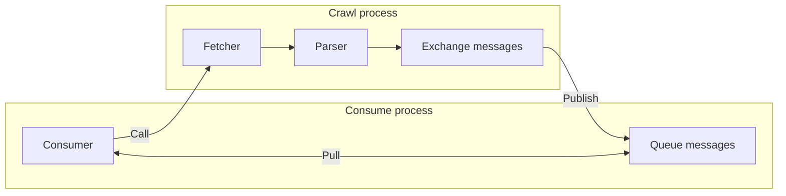
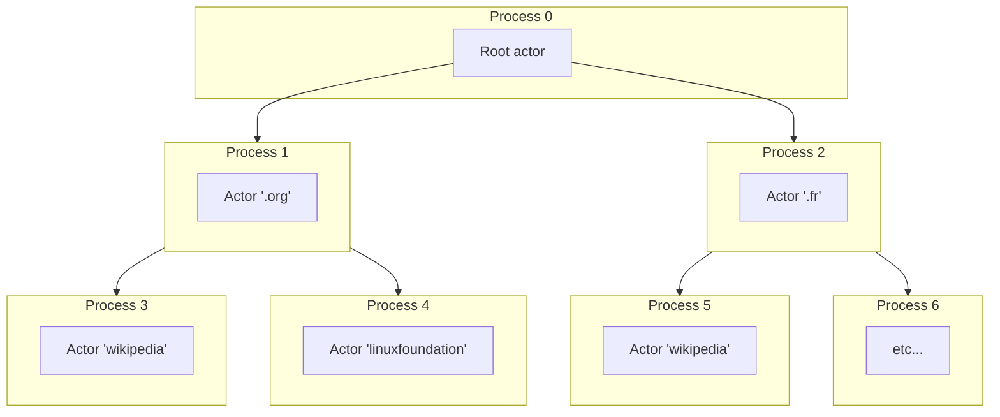

autoscale: true
theme: Fira, 6

## Et si le futur de la programmation concurrentielle avait déjà 50 ans ?

---

[.list: alignment(left)]

- Baptiste Langlade
- Architecte chez Efalia
- Lyon
- 10+ ans XP
- ~100 packages Open Source

---

### Crawler

---

---

---

---

## Simple mais difficile

^ simple au raisonnement mais innefficace

---

### Parallélisation

^ synchronisation problem

---

^ noisy neighbour

---

## Sharding

^ noisy neighbour

---

---

## Complexité exponentielle

^ au plus on veut optimiser les ressources au plus la complexité croit

---

## Problème insoluble ?

^ problème valable pour des imports, webhooks, syncro de systèmes, etc...

---

## Actor Model

^ 1973 par Carl Hewitt, WhatsApp, RabbitMQ

---

### Actor

- Traite une file de messages
- Peut créer d'autres acteurs
- Peut envoyer des messages aux autres acteurs

^ ~= 1 process, 1 message à la fois

---

### System

---

### Documentation

---

---

## Questions

X/Bluesky/Mastodon @Baptouuuu

<https://baptouuuu.github.io/conferences/>
