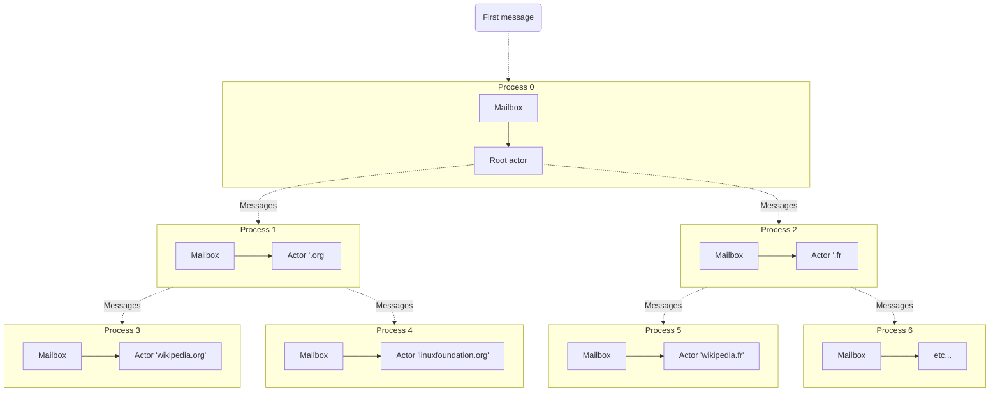
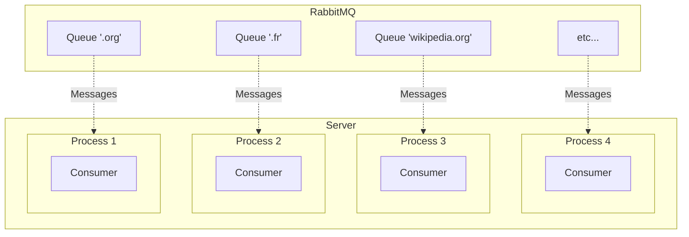
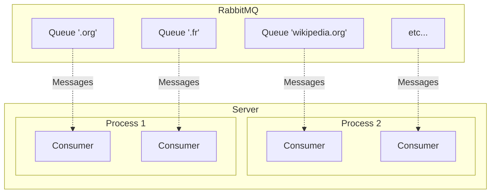
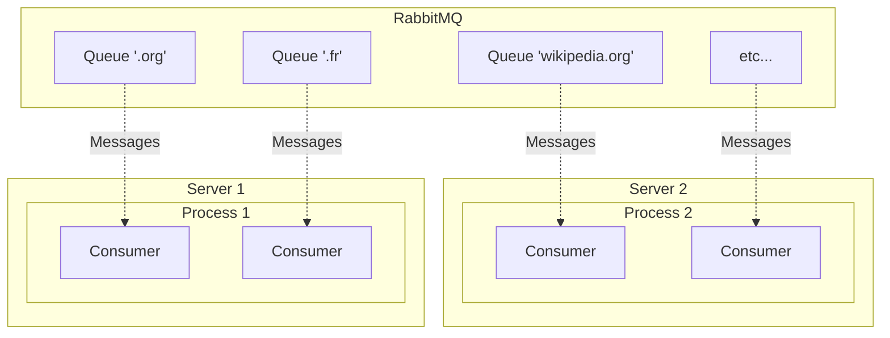

autoscale: true
theme: Fira, 6

## Et si le futur de la programmation concurrentielle avait déjà 50 ans ?

---

[.list: alignment(left)]

- Baptiste Langlade
- Architecte chez Efalia
- Lyon
- 10+ ans XP
- ~100 packages Open Source

---

## Crawler

---


---


---

[.code-highlight: 3-9]
[.code-highlight: 4]
[.code-highlight: 5]
[.code-highlight: 6-8]
[.code-highlight: 1-2, 10-11]

```php
$rabbitmq
    ->with(Consume::of('queue')->handle(
        static function(Message $message) use ($rabbitmq) {
            $url = decodeUrl($message);
            $urls = crawl($url);
            $rabbitmq
                ->with(Publish::many($urls)->to('queue'))
                ->run();
        },
    ))
    ->run();
```

---


---

## Simple mais inefficace

^ simple au raisonnement mais inefficace

---

### Parallélisation


^ synchronisation problem

---

```sh
php consumer.php & php consumer.php &
```

---

## `robots.txt`

---

[.code-highlight: 1-3]
[.code-highlight: 4]

```
User-agent : Googlebot
Allow : /foo
Disallow : /bar
Crawl-delay : 10
```

---


^ noisy neighbour: un consumer peut empêcher les autres de run

---

[.code-highlight: 6]

```php
$rabbitmq
    ->with(Consume::of('queue')->handle(
        static function(Message $message) use ($rabbitmq) {
            $url = decodeUrl($message);

            lock($url); // appel bloquant

            $urls = crawl($url);
            $rabbitmq
                ->with(Publish::many($urls)->to('queue'))
                ->run();
        },
    ))
    ->run();
```

---

## Partitionnement / Sharding


---

[.code-highlight: 5-11]

```php
$rabbitmq
    ->with(Consume::of('queue')->handle(
        static function(Message $message) use ($rabbitmq) {
            $url = decodeUrl($message);
            $urls = crawl($url);
            $fr = $urls->filter(isDotFr(...));
            $org = $urls->filter(isDotOrg(...));
            $rabbitmq
                ->with(Publish::many($fr)->to('queue1'))
                ->with(Publish::many($org)->to('queue2'))
                ->run();
        },
    ))
    ->run();
```

^ problème un consumer peut être plus actif qu'un autre

---


---

## Complexité exponentielle

^ au plus on veut optimiser les ressources au plus la complexité croit

---

## Problème insoluble ?

^ problème valable pour des imports, webhooks, syncro de systèmes, etc...; problème de logique

---

## Actor Model

^ 1973 par Carl Hewitt, pb concurrence => supprimer concurrence

---

[.list: alignment(left)]

### Actor

- Traite une file de messages
- Peut créer d'autres acteurs
- Peut envoyer des messages aux autres acteurs

^ ~= 1 process, 1 message à la fois

---


---


---

[.code-highlight: 1]
[.code-highlight: 3]
[.code-highlight: 5-6]
[.code-highlight: 7-15]

```php
final class Crawler implements Actor
{
    public function __invoke(Receive $receive): Receive
    {
        return $receive->on(
            Url::class,
            function(
                Url $url,
                Address $sender,
                Continuation $continuation,
            ) {
                $urls = crawl($url);

                return $continuation->continue($urls);
            },
        );
    }
}
```

---

[.code-highlight: 1]
[.code-highlight: 2-5]
[.code-highlight: 6-9]

```php
System::of()
    ->actor(
        Crawler::class,
        static fn() => new Crawler,
    )
    ->run(
        Crawler::class,
        Url::of('https://wikipedia.org'),
    );
```

---



^ actors come in systems alias diviser pour mieux régner, addresses as messages

---

[.code-highlight: 6]
[.code-highlight: 15]
[.code-highlight: 16-18]
[.code-highlight: 3-4]
[.code-highlight: 20]

```php
final class Crawler implements Actor
{
    /** @var array<string, Address> */
    private array $tlds;

    public function __construct(private Spawn $spawn)
    {
    }

    public function __invoke(Receive $receive): Receive
    {
        return $receive->on(
            Url::class,
            function(Url $url, Address $sender, Continuation $continuation) {
                $tld = $url->tld();
                $child = $this->tlds[$tld] ??= ($this->spawn)(
                    ChildCrawler::class,
                );

                $child($url);

                return $continuation->continue();
            },
        );
    }
}
```

---

[.code-highlight: 1]
[.code-highlight: 5-6]
[.code-highlight: 8-10]
[.code-highlight: 7]

```php
final class ChildCrawler implements Actor
{
    public function __invoke(Receive $receive): Receive
    {
        return $receive->on(
            Url::class,
            function(Url $url, Address $sender, Continuation $continuation) {
                $urls = crawl($url);
                $urls->foreach(static fn($url) => $sender($url));

                return $continuation->continue();
            },
        );
    }
}
```

---

[.code-highlight: 4]
[.code-highlight: 6-9]

```php
System::of()
    ->actor(
        Crawler::class,
        static fn($_, $__, Spawn $spawn) => new Crawler($spawn),
    )
    ->actor(
        ChildCrawler::class,
        static fn() => new ChildCrawler,
    )
    ->run(
        Crawler::class,
        Url::of('https://wikipedia.org'),
    );
```

---


## En pratique ça donne quoi ?

^ simple et scalable, pause

---

| Actor Model | RabbitMQ |
|:-:|:-:|
| Mailbox | Queue |
| Actor | Consumer |

---



---

## Problème de ressources ?

^ process !== process système

---

## Parallélisation + Asynchrone

---


^ cpu bound 👍

---


^ IO bound 👍

---


---



---



---

## Avantages

---

## Scalabilité infinie

^ single process -> multi process -> cluster, WhatsApp, RabbitMQ

---

## Résilience

^ gestion des erreurs

---

## Déploiement progressif

---

## Unifier des paradigmes différents

^ un actor ne devrait pas savoir s'il est exécuté en async ou pas, utile pour les tests

---


## <https://innmind.org>


---

## Monades

---


---

## Tests

^ PBT async, blackbox

---


---

## Demo

---


---

## 🚧 <https://github.com/innmind/actors> 🚧


---

## Questions


X/Bluesky/Mastodon @Baptouuuu

<https://baptouuuu.github.io/conferences/>
