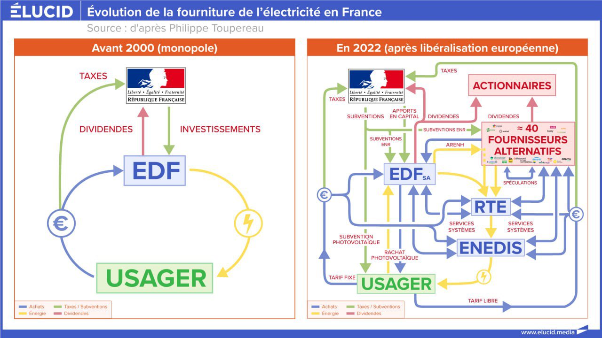
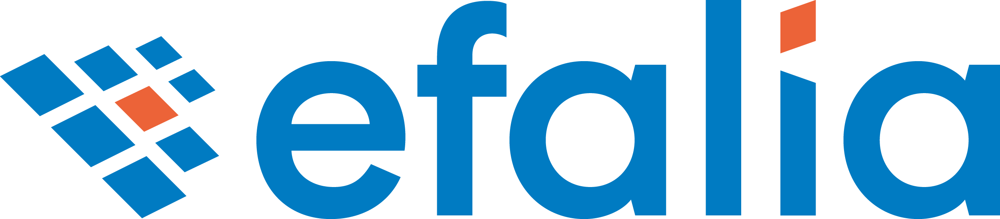

autoscale: true
theme: Fira, 6

## Simplifiez vous la vie, codez en français

---

### 🍅🍅 Tomates non fournies 🍅🍅

---

## Courtage en énergie

^ équipe française, marché français, réglementation purement française

---



---

## DDD

^ mise en place à notre arrivée, meilleure séparation des concepts

---

## Ubiquitous langage

---

## Anglais

^ pourquoi alors que le métier est en français ?

---


^ "je sais pas vous, mais je suis pas venu pour souffrir"

---



^ refonte projet, échec de 2 ans, repartir de zéro en code (mais avec vision PO)

---

## 2 mois de définitions

^ les concepts n'étaient pas clair, tout était un "type"

---

## Différents niveaux d'anglais

^ 1 bilingue, 1 qui n'aime pas et 1 entre les 2

---


---

[.list: alignment(left)]

### Lexique

- Armoire
- Gabarit de document
- Document
- Métadonnée
- Bannette
- etc...

---

[.list: alignment(left)]

### API

- `POST /api/armoires/`
- `GET /api/gabarits-de-document/{id}`
- `DELETE /api/documents/{id}`
- `PUT /api/documents/{id}/metadonnees`

---

### OpenAPI

```json
{
  "content": {
    "application/json": {
      "schema": {
        "type": "object",
        "required": [
          "gabarit",
          "metadonnees"
        ],
        "properties": {
          "gabarit": {
            "$ref": "#/components/schemas/GabaritDeDocumentId"
          },
          "metadonnees": {
            "type": "array",
            "items": {
              "$ref": "#/components/schemas/Metadonnee"
            }
          }
        }
      }
    }
  }
}
```

^ pas d'accent, problème en front avec Angular

---

### Doctrine

```php
class Metadonnee
{
    private function __construct(
        private Id $id,
        private Format $format,
        private Libelle $libelle,
    ) {
    }

    // reste de la classe
}
```

^ attention ne supporte pas les accents partout

---

[.code-highlight: 1]

### `formal/orm`

```php
final readonly class Metadonnee
{
    private function __construct(
        private Id $id,
        private Format $format,
        private Libelle $libelle,
    ) {
    }

    // reste de la classe
}
```

^ supporte les accents partout, mais pas en cli

---

### SQL

```sql
CREATE TABLE metadonnee (
    id CHAR(36) NOT NULL,
    format VARCHAR(32) NOT NULL,
    libelle VARCHAR(255) NOT NULL,
    PRIMARY KEY(id)
);
```

---

### Psalm

```php
final class ClasserDocument
{
    /**
     * @param list<Metadonnee> $métadonnées
     */
    public function __invoke(
        Id $id,
        array $métadonnées,
    ): Document {
        /** @var array<array-key, mixed> $métadonnées */
    }
}
```

---

[.code-highlight: 4, 8, 10]

### Psalm

```php
final class ClasserDocument
{
    /**
     * @param list<Metadonnee> $metadonnees
     */
    public function __invoke(
        Id $id,
        array $metadonnees,
    ): Document {
        /** @var list<Metadonnee> $metadonnees */
    }
}
```

---

### PHPUnit

```php
class DocumentTest extends TestCase
{
    public function teste la possibilité de classer directement un document()
    {
    }
}
```

---

### PHPUnit

```php
class DocumentTest extends TestCase
{
    public function teste la possibilité de classer directement un document()
    {
    // espaces insécable 👆  👆          👆  👆      👆          👆  👆
    }
}
```

---

## Embauches

^ 3 personnes en 6 ans : bizarre -> problèmes sur les accents -> plus de retour en arrière, intégration simplifiée

---

## Tout le monde sur la même page

^ tech, produit, support, client. évite les dérives sur le nommage

---


---

### Et si... ?


^ en interne comme à l'extérieur

---

## Et si on se fait auditer par une boite internationale ?

^ et pourquoi pas une boite française ? différents audits, code = symbols, sécurité = dépendances

---

## Et si la boite devient internationale ?

^ 50 à 150 employés en 6 ans. français, anglais et allemand. allemands 2 ans sans problème. et qui dit que le projet n'aura pas été réécrit ?

---

## Et si on a vraiment pas le choix ?

^ avantage : doit forcer toute l'entreprise à adopter la même traduction.

---

### OpenAPI

```php
$path = Path::of(
    Template::of('/api/armoires/{id}'),
    Operation::put()
        ->parameters(
            Parameter::path('id')
                ->require()
                ->schema(Schemas::armoireId),
        )
        ->requests(
            Request::of(
                MediaType::json,
                Shape::of()
                    ->require('nom', Str::of()),
            ),
        ),
);
```

---

```php
/** @var array{nom: string} $payload */
$payload = $path->validate($request);
```

---

[.code-highlight: 14]

### OpenAPI

```php
Path::of(
    Template::of('/api/armoires/{id}'),
    Operation::put()
        ->parameters(
            Parameter::path('id')
                ->require()
                ->schema(Schemas::armoireId),
        )
        ->requests(
            Request::of(
                MediaType::json,
                Shape::of()
                    ->require('nom', Str::of())
                    ->translate('en', ['nom' => 'name']),
            ),
        ),
);
```

---

```php
/** @var array{nom: string} $payload */
$payload = $path->validate($request, 'en');
```

---

## Et si on embauche des employés non francophone ?

^ d'autres problèmes avant le code (remote, timezone, etc...). Traduction automatique des naviageteurs pour doc et PRs

---

## Conclusion

^ levées de boucliers

---

## Problèmes de riches

^ si boite devient internationale c'est qu'elle tourne bien

---

> Premature optimization is the root of all evil.
> -- Donald Knuth, 1974

---

## Rationnel ou Dogme ?

^ se poser sérieusement la question

---

> Les Français

^ les seuls à se plaindre du français en 6 ans

---

## Simplifiez vous la vie, codez en français !

---

# 🍅
