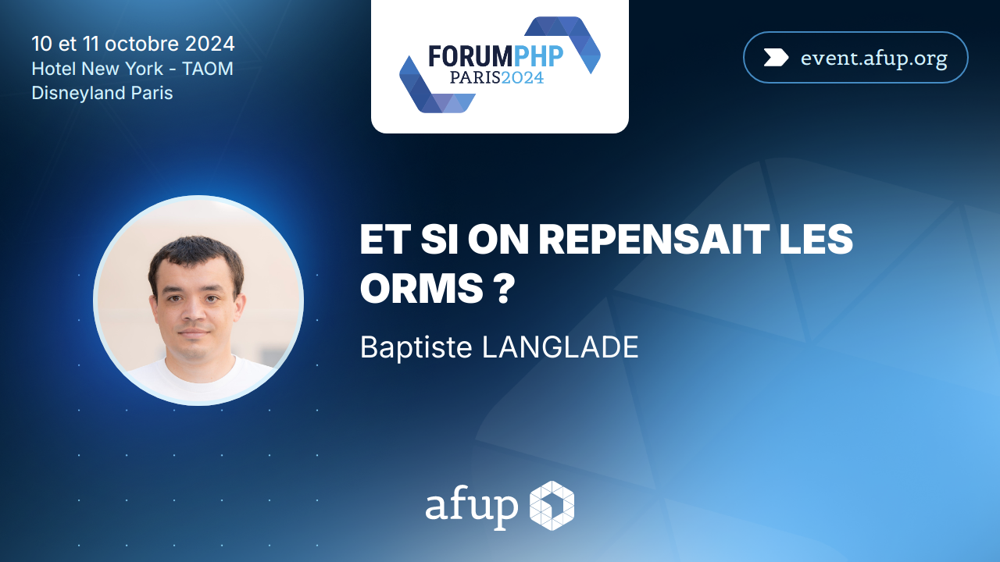

autoscale: true
theme: A11y

## Archiver efficacement de grands volumes de données grâce aux monades

---

[.list: alignment(left)]

- Baptiste Langlade
- Lyon
- 10+ ans XP
- ~100 packages Open Source

---


---

## GED

^ on premise => interventions difficiles

---

[.list: alignment(left)]

- Documents
    - Métadonnées
    - 1..N binaires

^ utiliser la carte d'identité pour expliquer les N versions

---

## Archivage

^ archivage définies par métadonnées, sur plusieurs années/décennies

---

[.list: alignment(left)]

- Archive
    - CSV des documents
    - Dossiers contenant les binaires

^ en 1 seul fichier

---

## Contraintes

^ taille archive, intervention impossible

---

## Comment on fait ?

---

## Streaming de données

---

```php
$file = \fopen('names.txt', 'r');

while ($line = \fgets($file)) {
    echo $line;
}
```

---

[.code-highlight: 1]
[.code-highlight: 2]
[.code-highlight: 3]
[.code-highlight: 4]

```txt
alice
bob
jane
john
etc...
```

---

[.code-highlight: 1-8]
[.code-highlight: 6]

```php
/** @var \Generator<string> */
$stream = function(): \Generator {
    $file = \fopen('names.txt', 'r');

    while ($line = \fgets($file)) {
        yield $line;
    }
};
```

---

```php
foreach ($stream() as $line) {
    echo $line;
}
```

---

[.code-highlight: 1]
[.code-highlight: 2]
[.code-highlight: 3]
[.code-highlight: 4]

```txt
alice
bob
jane
john
etc...
```

^ important avoir une seule variable en mémoire

---


---


---

```php
/**
 * @param callable(): \Generator<string> $stream
 * @var \Generator<string>
 */
$trim = function(callable $stream): \Generator {
    foreach ($stream() as $line) {
        yield \rtrim($line, "\n");
    }
};
```

---

```php
foreach ($trim($stream) as $line) {
    echo $line.",\n";
}
```

---

[.code-highlight: 7]

```php
/**
 * @param callable(): \Generator<string> $stream
 * @var \Generator<string>
 */
$trim = function(callable $stream): \Generator {
    foreach ($stream() as $line) {
        yield \rtrim($line, "\n");
    }
};
```

---

```php
foreach ($hello($capitalize($trim($stream))) as $line) {
    echo $line.",\n";
}
```

---

## Monades

---

```sh
composer require innmind/immutable
```

---

```php
use Innmind\Immutable\Sequence;

/** @var Sequence<string> */
$stream = Sequence::lazy(function() {
    $file = \fopen('names.txt', 'r');

    while ($line = \fgets($file)) {
        yield $line;
    }
});
```

---

```php
$stream->foreach(function(string $line) {
    echo $line;
});
```

---

[.code-highlight: 1-2]
[.code-highlight: 3-5]

```php
/** @var Sequence<string> */
$trimmed = $stream->map(fn(string $line) => \rtrim($line, "\n"));
$trimmed->foreach(function(string $line) {
    echo $line.",\n";
});
```

---

| | |
|-|-|
| `->map()` | `->flatMap()` |
| `->add()` | `->append()` |
| `->filter()` | `->aggregate()` |
| `->zip()` | etc... |

^ pause

---

## Style monadique

^ le jeu est de tout représenter via des Sequence

---

[.list: alignment(left)]

## Cas d'usage

- SQL
- Filesystem

---

### SQL

```php
/** @var Sequence<array> */
$rows = function(string $query): Sequence {};
```

---

### ORM

```php
/** @var Sequence<Entity> */
$entities = function(): Sequence {};
```

---

```sh
composer require formal/orm
```

---

```php
/** @var Sequence<Document> */
$documents = $orm
    ->repository(Document::class)
    ->all()
    ->sequence();
```

---



---

### Fichier

```php
final class File
{
    public function __construct(
        private string $name,
        /** @var Sequence<string> */
        private Sequence $content,
    ) {}
}
```

---

### Dossier

```php
final class Directory
{
    public function __construct(
        private string $name,
        /** @var Sequence<File|Directory> */
        private Sequence $content,
    ) {}
}
```

---

```sh
composer require innmind/filesystem
```

---

```php
use Innmind\Filesystem\File;
use Innmind\Filesystem\File\Content;
use Innmind\Immutable\Sequence;
use Innmind\Immutable\Str;

$file = File::named(
    'data.csv',
    Content::ofChunks(
        Sequence::lazy(fn() => yield from [
            "line, 1\n",
            "line, 2\n",
            "etc...",
        ]),
    ),
);
```

---

```php
use Innmind\Filesystem\Directory;

$directory = Directory::named(
    'files',
    Sequence::lazy(fn() => yield from [
        File::named('something', $content),
        Directory::named(...$args),
        // etc...
    ]),
);
```

^ pause

---

[.list: alignment(left)]

## Cas d'usage

- Archive
    - CSV des documents
    - Dossiers contenant les binaires

---

[.code-highlight: 1]
[.code-highlight: 2]
[.code-highlight: 3-9]
[.code-highlight: 8]
[.code-highlight: 1-10]

```php
$csv = File::named(
    'documents.csv',
    Content::ofChunks(
        $orm
            ->repository(Document::class)
            ->all()
            ->sequence()
            ->map(fn(Document $document): string => $document->toCsvLine()),
    ),
);
```

---

[.code-highlight: 6-12]
[.code-highlight: 7]
[.code-highlight: 8]
[.code-highlight: 9]
[.code-highlight: 10]
[.code-highlight: 11]
[.code-highlight: 6]

```php
use Innmind\Filesystem\Adapter\Filesystem;
use Innmind\Filesystem\Name;
use Innmind\Url\Path;
use Innmind\Immutable\Predicate\Instance;

$fetch = function(Document $document): Directory {
    return Filesystem::mount(Path::of('var/data/'))
        ->get(Name::of($document->id()->toString()))
        ->keep(Instance::of(Directory::class))
        ->attempt(fn() => new \Exception('Données perdues'))
        ->unwrap();
};
```

---

```php
$binaires = Directory::named(
    'binaires',
    $orm
        ->repository(Document::class)
        ->all()
        ->sequence()
        ->map($fetch),
);
```

---

```php
$archive = Directory::named(
    'archive',
    Sequence::lazy(fn() => yield from [
        $csv,
        $binaires,
    ]),
);
```

---

## Tar

---

[.code-highlight: 1-3]
[.code-highlight: 4-5]
[.code-highlight: 6-7]

```txt
directory/file.txt
line 1
line 2
directory/image.png
binary
directory/sub/file.ext
content
```

---

```sh
composer require innmind/encoding
```

---

[.code-highlight: 1-3]
[.code-highlight: 7-8]

```php
use Innmind\Encoding\Tar;

$tar = Tar::encode();

$archive = Directory::named(...$args);

/** @var \Innmind\Filesystem\File\Content */
$archive = $tar($archive);
```

---

```php
$documents = fetchDocuments($orm);
$archive = Directory::named(
    'archive',
    Sequence::lazy(fn() => yield from [
        toCsv($documents),
        binaires($documents),
    ]),
);
$archive = $tar($archive);
```

^ aucun traitement effectué pour l'instant

---

```php
use Symfony\Component\HttpFoundation\StreamedResponse;

new StreamedResponse(
    fn() => $archive
        ->chunks()
        ->foreach(function(Str $chunk) {
            echo $chunk->toString();
            \flush();
        });
);
```

---

[.code-highlight: 1]
[.code-highlight: 2]
[.code-highlight: 3]
[.code-highlight: 4]
[.code-highlight: 5]
[.code-highlight: 6]
[.code-highlight: 7]
[.code-highlight: 8-9]

```txt
archive/documents.csv
document 1, métadonnée, etc...
document 2, métadonnée, etc...
archive/binaires/uuid-document-1/v1.bin
binaire chunk 1
binaire chunk 2
etc...
archive/binaires/uuid-document-2/v1.bin
binaire
```

---

[.list: alignment(left)]

## Statistiques

- 100k documents
- ~80Go
- ~45 minutes
- ~45Mo/s
- ~40Mo de RAM

---

## Stateless

---


### Documentation


---


---

## Questions


X/Bluesky/Mastodon @Baptouuuu

<https://baptouuuu.github.io/conferences/>
